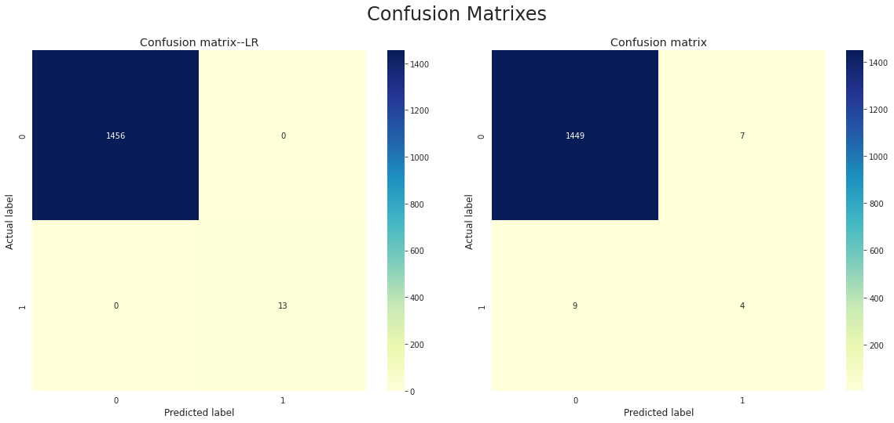

# Identifying Misinformation on Social Networks with Machine Learning

> A big-data analytics pipeline that classifies Twitter profiles as human or non-human (brand) and flags profiles whose recorded gender label is likely misinformation, using the `Twitter_user_data` dataset.
>
> **Led a six-member team.**

`Python` · `scikit-learn` · `NLTK / gensim` · `Logistic Regression · Naive Bayes · K-Means · LDA`

<p align="center">
  
</p>

## Problem
The project builds an analytics lifecycle to find misinformation on social networks, focused on distinguishing and correcting human vs non-human (brand) profiles. Various algorithms test whether a profile is mistakenly recorded as human when it is actually a brand, or vice versa. The aim is to predict the correct classification for each profile and suggest amendments for the mislabelled ones.

## Approach
1. **Data preparation** — Load `Twitter_user_data` (20,050 rows × 26 columns); drop gold-standard, id, and low-signal columns; inspect and handle missing values; categorise `fav_number` / `tweet_count` / `daily_tweet_count`; convert colours (Hex → RGB, warm/cool); and remove outliers via boxplots.
2. **Text processing** on `text`, `description`, `name` — remove punctuation, lowercase, strip special characters and short words, remove stop-words (NLTK), stem (PorterStemmer), then TF-IDF vectorisation, TextBlob sentiment scoring, and LDA topic modelling (gensim, 3 topics, evaluated with coherence score).
3. **Clustering** — K-Means (`n_clusters=2`) over combined numeric and TF-IDF text features; interpret cluster 0 as human and cluster 1 as non-human. Keep the profiles where the cluster agrees with the recorded gender as a "reliable" training subset (`df_trust`).
4. **Association rules** — Apriori (`min_support=0.07`) with `association_rules` (lift > 1, confidence > 0.8, via mlxtend) to relate features such as favourite count, tweet count, and sentiment to the human / non-human label.
5. **Classification** — Screen 8 classifiers with 10-fold ShuffleSplit, then train Logistic Regression (discriminative) and Gaussian Naive Bayes (generative) on `df_trust` using a stratified train/validation/test split and balanced class weights.
6. **Misinformation identification** — Apply the trained Logistic Regression model to the remaining profiles, flag those whose predicted label disagrees with the recorded gender, and cross-check them against the mined association rules to produce the final misinformation set.

## Results
- **Misinformation flagged (the deliverable):** applying the trained Logistic Regression model to the 6,529 held-out profiles surfaced 4,501 whose predicted label disagreed with the recorded gender; cross-checking these against the mined association rules narrowed the set to **1,151 candidate-misinformation profiles** (1,089 recorded as non-human, 62 as human), with a mean recorded `gender:confidence` of ~0.86.
- **Dataset:** 20,050 Twitter profiles × 26 columns, no duplicates. K-Means (k = 2) over numeric + TF-IDF text features produced a "reliable" training subset of **7,343 profiles** where the cluster agreed with the recorded gender.
- **Model screening** (10-fold ShuffleSplit, mean accuracy): Logistic Regression 0.9992, SGD 0.9992, KNN 0.9988, Random Forest 0.9930, Gaussian Naive Bayes 0.9903; tree models scored higher but overfit, and QDA was lowest (~0.82).
- **Selected models (trained on the reliable subset to reproduce the cluster-derived label):** Logistic Regression reproduced the label almost perfectly (100% test / 99.93% validation accuracy, ROC-AUC 1.0), and Gaussian Naive Bayes reached ~98.9% but was weak on the minority non-human class (F1 0.33). Because the target *is* the clustering output on the subset where clustering already matched the recorded gender — and the positive class is tiny (13 of 1,469 test rows) — these near-perfect scores act as an internal consistency check, not an independent benchmark.

## Limitations
Labels come from clustering rather than verified ground truth, so the classifier scores measure internal consistency rather than real-world detection accuracy; the 1,151 flagged profiles are candidates for review, not confirmed cases.

## Repository structure
```
.
├── Using machine learning to identify misinformation on the social network.ipynb   # full pipeline: prep → text mining → clustering → rules → classification
└── README.md
```

## Tech
- **Language / environment**: Python (Jupyter Notebook, run on Google Colab)
- **Data & ML**: pandas, NumPy, SciPy, scikit-learn (Logistic Regression, Gaussian Naive Bayes, K-Means, ColumnTransformer, TF-IDF, model selection/metrics)
- **NLP / topic modelling**: NLTK, gensim (LDA + coherence), spaCy, TextBlob (sentiment)
- **Rules & viz**: mlxtend (Apriori / association rules), pyLDAvis, WordCloud, matplotlib, seaborn, missingno

## Team & role
Author states: *"I led a six-member team in this Project."* (README)
